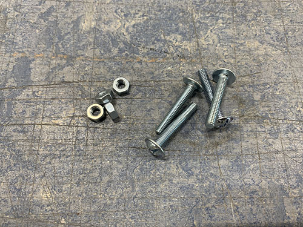

# X-axis and Z-axis

## Rails to bridge beams

The last two 600 mm MGN12H rails (**O21**) were attached to two of the 803 mm aluminium bridge beams (**O05**, used for the X-axis). First, the MGN12H blocks (**O22**) were carefully removed from the rails.

The same 100 mm distance used to align the belt tension sliders were used to align the rails. Because they will be off center by 3 mm, make sure that you later attach the bridge beams to the side plates in a way so the rails line up. 

The same 3d-printed support tools (**P25**) used to align the rails on the 900 mm aluminium profiles were used here as well. Everything was clamped into position. A bradawl and a hammer were used to make indentations and a 2 mm drill and a M3 drill tap was used to make the screw holes.

The rails were finally attached using 16 mm M3 screws (**S03**) and the MGN12H  rail blocks (**O22**) were gently slided back onto the rails.

## X-axis tensioner and end-stop mount to lower bridge beam

The fixed tensioner (**P28**) and end-stop mount (**P08**) were attached to the lower bridge beam in the same fashion as on the 900 mm aluminium profiles, using 4x 20mm M5 screws (**S12**). When aligning the fixed tensioner, make sure that the "belt opening" is pointing in the direction of the rail. A bradawl and a hammer were used to make indentations at the center of the holes. Cutting fluid was applied and a 4 mm drill was used to drill the holes, followed by a M5 drill tap.

## Bridge beams to side plates

All three bridge beams (**O05**) were then inserted into the slots on the side plates. Make sure that the two beams with the rails are on top of each other, with the rails pointing outwards. Also, make sure that you insert them in the correct orientation, so that the rails are lined up (due to the rails being 3 mm off center).

When the bridge beams were aligned, the blocker clips (**P21**, **P22**, **P23**, **P30**, **P31**, **P32**) were placed in their correct place and a sharpie was used to mark the center of the holes to be drilled. Similar to before, a bradawl and a hammer were used to make indentations at the center of the holes.

A 7 mm drill bit was used to drill the holes. As these holes were going straight through the profiles, a bench drill was used for precision. A metal file was used to remove all excess metal around the holes.

The bridge beams were then inserted into the slots on the side plates once more, along with all the blocker clips. 2x 140 mm threaded M5 rod (**T01**) was inserted through the bottom two beams and 2x 60 mm M5 (**S14**) screws was inserted through the top bridge beam. It was all tightened using M5 nuts (**N02**).

## Rod bearings to carriage

Before attaching the carriage (**P07**) to the bridge beams, two KFL08 rod bearings (**O19**) were attached on the top and the bottom of the carriage (inside) using 4x 20 mm M5 screws (**S12**) and 4x M5 nuts (**N02**). A tip is to temporarily use the acme rod (used in an upcoming step) to vertically align the two bearings.

## Carriage to bridge beams

The carriage was attached to the 4x MGN12H blocks (**O22**) on the bridge beams, using 16x 25 mm M3 screws (**S05**).

## X-axis motor, idlers and pulley to carriage

Each idler were made up out of 1x 60 mm fully threaded M8 screw (**S15**), 3x 698zz bearings (**O01**) and 4x (15 mm x 8.5 mm x 1.5mm) washers (**W03**) (1 closest to the idler blocker and 3 closest to the side plate). 2x idlers were then attached to each side plate using 2x M8 nuts (**N03**). Make sure that the bearings are spinning freely.

As I designed and added the idler blocker later on in the build, some of the images doesn't have it and they also have 3 washers instead of 1 washer closest to the screw head. I left these images anyways in the guide so you can see how it looks when you attach the idlers, but please ignore the wrong number of washers. Also ignore all the other things around the idlers in the upcoming image, they are taken later on in the build.

Should be idler blockers and a different number of washers in the upcoming images.

To attach the stepper motor to the carriage, the 4x M3 screws locking the gear box to the motor were removed.

The stepper motor was then inserted into the large hole on the carriage, facing towards the bridge beams/idlers. 4x 40 mm M3 screws (**S06**) and 4x M3 washers (**W05**) were used to lock the stepper motor onto the carriage. The motor should be attached so that the cables are facing upwards.

1x HTD5M timing pulley (**O18**) was attached to the motor shaft using set screws.

## X-axis HTD5M belt

The HTD5M belt (**O17**) was first inserted into the fixed belt tensioner using a flat screw driver. It was then stretched along the aluminium profile, below the first idler, around the timing pulley, below the second idler and all the way to the other side.

The belt was cut at an appropriate length and inserted into the belt tensioner (**P27**) using a flat screw driver.

The belt tensioner was then attached to the side plate using 1x 60mm fully threaded M8 screw (**S15**), 1x M8 nut (**N03**) and 1x (20mm x 10mm x 2mm) washer (**W04**). The M8 screw in the image is not fully threaded as I lost the one I was suppose to use and had to use another one, so please ignore :)

Make sure that the belt is not too loose and not too tight.

## Acme nut and rails to carriage slider

1x acme nut (**O03**) was inserted from the outside, into the the center hole at the top of the vertical carriage slider (**P36**). It was locked in place using 4x 25mm M3 screws (**S05**).

2x smaller 200 mm MGN12H rails (**O20**) were then attached to the back of the vertical carriage slider. First, the MGN12H blocks (**O22**) were carefully removed from each rail. After that, the rails were screwed in place on the back of the vertical carriage slider using 16x 20 mm M3 screws (**S04**). The MGN12H blocks were then slided back on and each end were blocked using tape. 

## Acme rod and vertical slider to carriage

To attach the vertical slider to the carriage, 16x 25 mm M3 screws (**S05**) were first inserted into the holes on the carriage. You might need to "open up" the holes using a narrow tool (depending on the direction you 3d-printed the carriage).

1x acme rod (**O02**) was then inserted through the two KFL08 rod bearings and the acme nut, and the set screws on the bearings were tightened.

The vertical slider was finally attached to the carriage by attaching the previously mentioned 16x 25 mm M3 screws (**S05**) to the MGN12H blocks on the vertical slider.

## Z motor mount and X-axis cable chain

The first step was to find a good length of the X-axis cable chain (**O09**). To simplify this process, the X-axis belt was removed to easier move the carriage along the X-axis.

The Z motor mount (**P40**) and the X-axis cable chain mount (**P38**) were then attached using 3x 25 mm M4 screws (**S10**), 3x M4 nuts (**N01**) and 3x (10mm x 5mm x 1mm) washers (**W01**).

They Z motor mount was then attached to the carriage using 2x 80mm M8 screws (**S16**), 2x M8 nuts (**N03**) and 1x (20mm x 10mm x 2mm) washers (**W04**). The vaccum mount was also inserted and attached to the right-side M8 screw. Please ignore the timing pulley attached to the acme rod in some of the images, it will be attached in a later step.

1x 1 meter cable chain (**O09**) were then clamped to the cable chain mount and to the back-side bridge beam. The carriage was then moved as far to the sides as possible. It's important that the chain doesn't touch any of the side plates when moved. In my case, I had to remove 3 links from the cable chain to get a good length of the chain.

The Z motor mount and cable chain mount were then disassembled and the cable chain was properly attached to the cable chain mount using 2x 25mm M4 screws (**S10**), 2x M4 nuts (**N01**) and 2x (10mm x 5mm x 1mm) washers (**W01**).

The Z motor mount and cable chain mount were then assembled again and attached to the carriage in the same fashion as before.

The carriage was move all the way to the right side plate and the cable chain was clamped to the lower back bridge beam.

A bradawl and a hammer were used to make indentations at the center of the two holes. Cutting fluid was applied and a 3 mm drill was used to drill the holes, followed by a M4 drill tap. The cable chain was then attached to the bridge beam using 2x 25 mm M4 screws (**S10**).

Finally, the X-axis belt was reattached and tightened.

## Y-axis cable chain

The Y-axis cable chain (**O09**) was attached to the frame using 1x cable chain mount (**P05**) and 1x cable chain support (**P06**). The cable chain mount was clamped to the left side of the lower frame and aligned with the last vertial beam. A bradawl and a hammer were used to make indentations at the center of the two holes. Cutting fluid was applied and a 4 mm drill was used to drill the holes, followed by a M5 drill tap. The cable chain mount was then attached to the lower frame using 2x 20 mm M5 screws (**S12**).

The cable chain support was only attached to the lower frame for the cable chain to rest on. It was aligned and attached it at the center between the second and third vertical beam. Make sure that it does not go below the bottom frame!

In the same way as the cable chain mount, a bradawl and a hammer were used to make indentations at the center of the two holes. Cutting fluid was applied and a 4 mm drill was used to drill the holes, followed by a M5 drill tap. The support was then attached to the lower frame using 2x 20 mm M5 screws (**S12**).

The Y-axis cable chain (**O09**) was then attached to the left side plate (**P20**) and lower frame support using 4x 25 mm M4 screws (**S10**), 4x M4 nuts (**N01**) and 4x (10mm x 5mm x 1mm) washers (**W01**).

## Z stepper motor, pulleys and belt

The non-geared NEMA17 stepper motor (**E11**) was attached to the Z-axis motor mount using 4x 8mm M3 screws (**S08**) and 4x M3 washers (**W06**). Make sure that the motor cable connector is pointing in the same direction as the opening of the X-axis cable chain.

1x 16 teeth GT2 timing pulley (**O15**) was then attached to the motor shaft and 1x 60 teeth GT2 timing pulley (**O16**) was attached to the acme rod. Both were locked in place using set screws. Make sure that they line up. 

1x GT2 timing belt (**O14**) was looped around both timing pulleys and stretched. Before tightning the M3 screws and locking the motor into place, make sure that the belt is not too loose and not too tight. 

