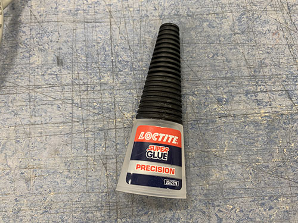

## Electrical wiring and connect components

### Main power supply

**NOTE: THIS PART INCLUDES WIRING OF HIGH VOLTAGE ELECTRICITY THAT CAN BE LETHAL IF NOT DONE PROPERLY. THE COLORS OF THE CABLES CAN VARY DEPENDING ON REGION/COUNTRY AND YOUR COMPONENTS/PINOUT NUMBERS MIGHT LOOK DIFFERENT. BEFORE YOU CONNECT THE POWER CORD TO THE POWER OUTLET, YOU MUST CONSULT WITH A LICENSED ELECTRICIAN TO MAKE SURE THAT EVERYTHING IS PROPERLY WIRED AND THAT IT IS IN LINE WITH YOUR LOCAL LEGISLATIONS.**

!!! danger
    THIS PART INCLUDES WIRING OF HIGH VOLTAGE ELECTRICITY THAT CAN BE LETHAL IF NOT DONE PROPERLY. THE COLORS OF THE CABLES CAN VARY DEPENDING ON REGION/COUNTRY AND YOUR COMPONENTS/PINOUT NUMBERS MIGHT LOOK DIFFERENT. BEFORE      YOU CONNECT THE POWER CORD TO THE POWER OUTLET, YOU MUST CONSULT WITH A LICENSED ELECTRICIAN TO MAKE SURE THAT EVERYTHING IS PROPERLY WIRED AND THAT IT IS IN LINE WITH YOUR LOCAL LEGISLATIONS.

The large electronic box was detached from the frame.

The 200W power supply (**E02**) was then attached to the back panel of the larger electronic box using 4x 5mm M3 screws (**S07**) unscrewed from the geared stepper motors.

The C14 connector/terminal (**E14**) and the emergency stop switch (**E17**) were inserted into the holes on the front plate of the large electronic box. 

A small brown/red wire (**E06**) was cut out and the ends were stripped and twisted. Two 4.8 mm spade connectors (**E26**) were then attached to the stripped wire using a plier. The space connectors were connected between **10** and **1A** on the back side of the C14 connector.

A longer brown wire was cut out to reach between **L** on the C14 connector and **13** on the emergency stop switch. The ends were stripped and twisted. A 4.8 mm spade connector (**E26**) was attached to the side connected to the C14 connector and a 6.3 mm space connector (**E27**) was attached to the side connected to the emergency stop switch. The spade connectors were then connected.

Two short and one longer blue wire were cut out at an appropriate length and the ends of the wires were stripped and twisted.

Two 4.8 mm spade connector (**E26**) were attached to one of the sides of each shorter wire and the other sides were inserted and locked into 1x 3-way Wago 221-413 (**E07**).

A 6.3 mm space connector (**E27**) was attached to one side of the longer blue wire and the other side were inserted and locked into the 3-way Wago 221-413 (**E07**).

I didn't have access to matching colors of all the spade connectors, so I followed the appropriate color scheme of the wires instead. So please ignore if there's a mismatch between the wire color and the spade connector color in the upcoming images.

The shorter blue wires were connected to **N** and **XX** on the C14 connector. The longer blue wire was connected to **23** on the emergency stop switch.

One brown and one blue wire were cut out to reach between the emergency stop switch and the power supply's input terminals. The ends of the wires were stripped and twisted. Two 6.3 mm space connectors (**E27**) were attached to one side of the wires and 2x M4 ring terminals (**E24**) were attached to the other side. The blue wire's spade connector was connected to **24** on the emergency stop switch. The brown wire's spade connector was connected to **14** on the emergency stop switch.

A small green/yellow wire was cut out to reach between the C14 connector and the power supply's input terminals. The end of the wire was stripped and twisted, a 4.8 mm spade connector (**E26**) was attached to one side and 1x M4 ring terminal (**E24**) was attached to the other side. The spade connector was then attached to **⏚** (ground) on the C14 connector.

The three M4 ring terminals were then connected to the power supply's input terminals in the following way:

* Brown -> AC/L
* Blue -> AC/N
* Green/Yellow -> **⏚** (ground)

Power was connected to the C14 connector (read [this](#connect-main-electronic-box) note before connecting the power) and a multimeter was used to verify that the power supply outputted 12V. The multimeter was also used to verify that the C14 connector worked properly (cut power when using the switch) and that the emergency stop switch worked propertly (cut power when pushed. Also that the emegency stop switch remains off when C14 connector is switched off and on again).

The emergency stop switch was attached to the front plate using 2x 18mm M4 screws (**S09**), 2x M4 nuts (**N01**) and two (9 mm, 4.5 mm, 1 mm) washers (**W07**).

The C14 connector was attached to the front plate using super glue. A cloth was used to remove excess glue.

Shrink tubes (**O24**) were cut out at an appropriate length, one for each spade connector. Each spade connector was then temporarily removed and inserted into its shrink tube, before attached back again. The shrink tubes were then shrunk around all the spade connectors.

### Prepare power to steppers and connect fans and LED

To prepare the power for the stepper motors, one black and one red wire (**E03**) were cut out (approx. 300 mm long) to reach between the 12V terminals on the power supply and the small electronic box containing the Arduino and CNC shield. One side of each wire was then stripped and twisted, and 2x M3 ring terminals (**E23**) were attached. 

The red wire was connected to the **V+** and the black wire was connected to **V-**.

A 40x40 mm 12V fan (**E01**) was attached to the back side of the large electronic box's front panel, using 4x 12 mm M3 screws (**S02**). The fan was attached to blow air out of the box.

A 12V red LED (**E22**) was inserted into the small ~8 mm hole on the front of the large electronic box's front panel.

The second 40x40 mm 12V fan (**E01**) was attached to the back side of the small electronic box's front panel, using 4x 12 mm M3 screws (**S02**). A short flexible conduit (**O13**) reaching between the two eletronic boxes was cut out and the wires from the fan were inserted through it.

The loose wires of the two fans and the LED were stripped and twisted together, black together and red together. Then all three black wires were attached into the same M3 ring terminal (**E23**) and all three red wires were attached into the same M3 ring terminal (**E23**).

The red wires (red ring terminal) were finally connected to the **V+** and the black wires (blue ring terminal) were connected to **V-** on the 12V power supply.

The red and black 12V power wires intended for the stepper motors were inserted through the same short flexible conduit as the fan wires.

2x 3d-printed strain relief halves (**P11**) were inserted into the hole on the side of the large electronic box facing the small electronic box. The large box was then carefully closed and attached to the upper and lower frame again. It's really important that you don't have to force it closed. If that's the case you need to move some cables for it to close smoothly.

### Assemble stepper motor drivers and tune VRef

One small heatsink was attached to each DRV8825 stepper driver (**E16**).

Before the stepper motors were connected to the CNC shield, the stepper motor drivers' VRef needed to be tuned. The VRef regulates the voltage from the stepper driver to the stepper motor. If the VRefs are set to high, it can damage the stepper motors by supplying to much voltage.

The CNC shield (**E10**) was first attached to the Arduino Uno (**E09**).

The four stepper drivers were then attached to the CNC shield, one for each axis (X, Y, Z) and one for the mirrored Y-axis (A). The stepper drivers were inserted so that the "EN" pins on the stepper drivers aligned with the EN female terminal on the CNC shield.

A USB cable (**E28**) was connected to the Arduino Uno and to a computer to supply the Arduino with power. 

The power wires connected to the 12v power supply were connected to the CNC shield:

* Red cable -> **+**
* Black cable -> **-**

Power was then added to the system by inserting the C13 cable (**E30**) into the C14 connector on the front panel of the large electronic box.

A multimeter was then used to regulate the VRef on each stepper driver. The equation to calculate the VRef differs depending on the stepper driver. The DRV8825 stepper drivers are using the following equation:

By checking the `I_{max}` in the technical specification for each stepper motor, the following VRefs were calculated for each stepper driver:

| Stepper driver  | I_{max} | VRef           |
|-----------------|---------|----------------|
| X               | 1.68A   | 1.68/2 = 0.84V |
| Y               | 1.68A   | 1.68/2 = 0.84V |
| A (mirrored Y)  | 1.68A   | 1.68/2 = 0.84V |
| Z               | 1.68A   | 1.68/2 = 0.84V |

To measure the VRef of each stepper driver, the red test probe was connected to the screw on top of the stepper driver, and the black test probe was connected to the second bottom left pin (GND). The screw was then rotated to adjust the VRef to the appropriate voltage (~0.84V).

### Attach Arduino and solder USB cable

The CNC shield was removed from the Arduino and the Arduino was attached to the back plate of the small electronic box using the 4x 5mm M3 screws (**S07**) unscrewed from the geared stepper motors. The USB cable was left inserted in the Arduino, as there was no space to insert it afterwards.

The end of the USB cable was cut and stripped, showing the following 4 wires inside:

| Color | Type      |
|-------|-----------|
| Red   | VCC (+5V) |
| White | Data -    |
| Green | Data +    |
| Black | GND       |

Each wire was stripped and twisted.

A female USB-A (**E29**) was inserted into the front plate of the small electronic box. By using a soldering iron, solder/filler metal was first added to each pin on the female USB-A before attaching the wires, to simplify the soldering. 

4 small shrink tubes (**O24**) were cut out and the wires were inserted into the shrink tubes. 

To know which wire to solder to which pin, the following schema was used. The schema illustrates when looking straight into the female USB-A, with the flat surface at the top and the internal USB pins pointing downwards. As the pins goes straight through the connector, it's possible to map it to the pins on the back.

When the correct pin-wire-mapping was found, the wires were soldered one by one, by placing the stripped wires on the pins and then pressing the solder iron onto the tip of the wires. As filler metal had already been applied to the pins, no extra filler metal had to be added. The shrink tubes were then shrunk around the wires.

Finally, a 3d-printed block (**P33**) was glued to the female USB-A connector and the back of the front panel to lock it into place.

### Stepper and end-stop cable management to small electronic box

The CNC shield was attached to the Arduino and 6x 3d-printed strain relief halves (**P11**) were inserted into the holes on the sides of the small electronic box.

Two flexible conduits (**O13**) were cut out to reach between the end of the Y-axis cable chain and the two holes in the small box. A hole was then drilled in the upper flexible conduit for the Y-axis end-stop wires to enter. To do this, the upper flexible conduit was placed where it was intended to be and tape was used to indicate the position of the hole. 

A drill was then used to create the hole in the upper flexible conduit.

The Y-axis end-stop (+ and -) wires were inserted into the hole, followed by half of the wires coming from the Y-axis cable chain. The rest of the wires were inserted into the lower flexible conduit.

To simplify the process, the cables going into the same conduit were taped together.

The end of the conduits were then placed between the strain relief halves and the front-middle part of the box were carefully attached to the frame again, locking the strain reliefs and the flexible conduits in place.

### Connect steppers to CNC shield

To keep a good structure of the wires inside the small box, electrical crimp sleeves (**E15**) and contact housings (**E13**) were used. This also reduced the risks of shortings and loose wires.

For each stepper, the wires were cut at an appropriate length to reach to its connection on the CNC shield. Each wire were stripped and twisted. An AWG22/24 crimp connector was then attached to the end of each wire using a crimping tool. A shrinking tube (**O24**) was shrunk around the wires to keep a good structure.

The wires were then inserted and locked into a 1X4 contact housing (**E13**). Make sure to insert the wires in the correct orinentation, as the crimp connector has a "lock" that interlocks with the contact housing.

To know in which order to insert the wires, check the technical specification of your steppers. You should find something like this (given that you've bought bi-polar stepper motors):

| A+    | A-    | B+  | B-   |
|-------|-------|-----|------|
| Black | Green | Red | Blue |

**A** and **B** indicate the two different coils in the stepper motor and the colors are the colors of the wires. You want to connect the crimp connectors so that each coil's wires are next to each other: **A A B B**.

This was done for all four steppers (X, Y, Z, A (mirrored Y)). Tape and a sharpie was used to indicate which contact housing beloning to which stepper. The contact housings were then connected to its connections on the CNC shield.

Note that if any of the steppers are moving in the "wrong" direction later on, you can just turn the connection 180 degrees and it will move the opposite way.

Finally, two jumpers (**E19**) were attached to the blue and yellow column on the "Y row". This tells the Arduino to mirror the Y-stepper instructions to the stepper connected to the **A** connection.

### Connect end-stops to CNC shield

As with the stepper motor wires, electrical crimp connectors were used to keep a good structure in the small electornic box.

For each end-stop, the two wires were cut at an appropriate length to reach to its connection on the CNC shield. Each wire were stripped and twisted. An AWG22/24 crimp connector (**E15**) was then attached to the end of each wire using a crimping tool. 

As I didn't have access to any 1x2 contact housings (**E12**), a shrinking tube (**O24**) was shrunk around each crimp connectors to reduce the risk of shorts.

This was done for all end-stops (X+, X-, Y+, Y- and Z+). Tape and a sharpie was used to indicate which pair of wires beloning to which end-stop. The crimp connector pairs were then connected to its connections on the CNC shield.

### Set microstepping

Microstepping is a way to control the stepper motors in a smoother way and at a higher resolution, but usually at a lower speed and torque. 

The 6 pins (M0, M1, M2) underneath each stepper driver were used to set the microstepping for each motor. By shorting the pins in certain combinations, different type of microstepping can be achieved (**0** indicates no shorting, **1** indicates shorting):

| Microstepping | M0 | M1 | M2 |
|---------------|----|----|----|
| Full-step     | 0  | 0  | 0  |
| 1/2           | 1  | 0  | 0  |
| 1/4           | 0  | 1  | 0  |
| 1/8           | 1  | 1  | 0  |
| 1/16          | 0  | 0  | 1  |
| 1/32          | 1  | 0  | 1  |

The 4 stepper drivers were carefully removed. The microstepping was set to `1/16` for each motor by shorting the two `M2` pins using jumpers (**E19**). The stepper drivers were then carefully inserted back again.

### Router cable management and connect to main power supply

**NOTE: THIS PART INCLUDES WIRING OF HIGH VOLTAGE ELECTRICITY THAT CAN BE LETHAL IF NOT DONE PROPERLY. THE COLORS OF THE CABLES CAN VARY DEPENDING ON REGION/COUNTRY AND YOUR COMPONENTS/PINOUT NUMBERS MIGHT LOOK DIFFERENT. BEFORE YOU CONNECT THE POWER CORD TO THE POWER OUTLET, YOU MUST CONSULT WITH A LICENSED ELECTRICIAN TO MAKE SURE THAT EVERYTHING IS PROPERLY WIRED AND THAT IT IS IN LINE WITH YOUR LOCAL LEGISLATIONS.**

As I wanted the emergency stop switch to kill the router as well, the router cable was inserted into the small electronic box to reach the emergency stop switch in the large electronic box.

A round cable grommet (**O25**) was inserted in the left side of the small electronic box, aligned between the two main wire holes.

The center of the hole was measured and drilled using a 8.5 mm drill. The cable grommet was then inserted and super glue was used to keep it in place.

The router cable was then inserted into the cable grommet. Some ordinary soap was used to reduce the friction between the rubber cable grommet and the rubber cable.

A cable tie (**O11**) was closed around the router cable on the inside of the box as a strain relief.

The large electronic box was opened once more and the router cable was inserted through the flexible conduit into the large electronic box. A cable clip (**O10**) was then used to position the router cable inside the small box.

The small electronic box was then carefully closed. It's really important that you don't have to force it closed. If that's the case you need to move some cables for it to close smoothly.

The blue and brown wires going between the emergency stop switch and the 12V power supply were cut in the middle and stripped and twisted. The router cable and the wires inside were also stripped and twisted.

The three brown wires were inserted and locked into a 3-way Wago 221-413 (**E07**). The three blue wires were also inserted and locked into a 3-way Wago 221-413 (**E07**).

The large electronic box was then carefully closed once more. It's really important that you don't have to force it closed. If that's the case you need to move some cables for it to close smoothly.

### Final test of electrical wiring

The electrical wiring was tested by plugging in a C13 cable (**E30**) into the C14 socket and the C14 switch and emergency stop switch were turned on. But before this was done, I made sure that the router was turned off.

The red LED should light up, both fans should rotate and the router should rotate when turned on.

